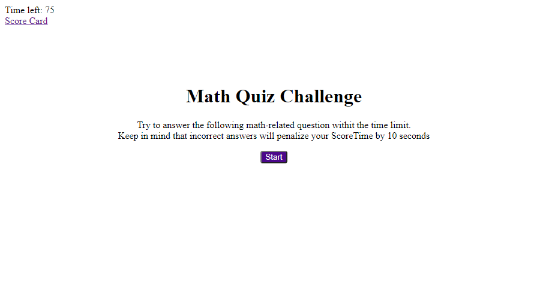
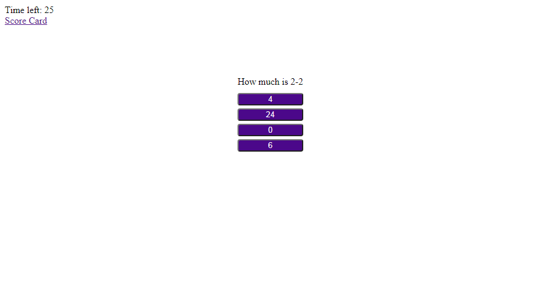
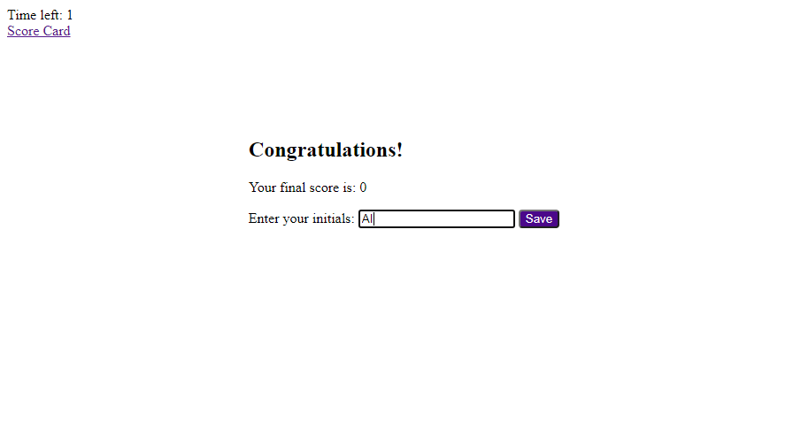
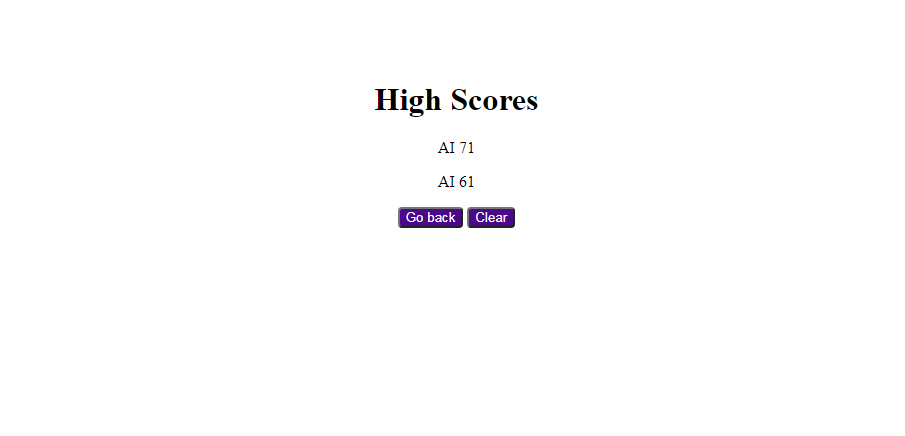

# Math Quiz Code Application

## Description 

The client has requested a quiz application, that presents you with a combination of multiple-choice questions and keeps the score. When the quiz is complete, the client will be transfered to another page, where he will be able to save his progress and compare it to his previous records.

## Table of Contents

* [Installation](#installation)
* [Usage](#usage)
* [Links](#links)
* [Credits](#credits)
* [License](#license)

## Installation

For this task we need to unstall the VS Code programm to write the code. Also the Dev Tools in Google Chrome browser will come very useful to test the application. In the file structure is very simple and lightweigt. The application is written in HTML, CSS and JavaScript languages. It containes 2 pages with users interface, one with styles and two pages with the script, responsible for the functionality. 

## Usage

When the user opens the application, he will be greated and presented with a Start button, that launches the function, that brings on the screen a series of questions with 4 buttons for answer choices. The countdown starts at 75 seconds. If a question is answered wrong, a 10-second penalty will be sunstracted from the timer. If a question is answered correctly, the application will give a message "Correct!". 
When all questions are answered or the countdown reaches 0, the quiz will end and the user will be able to save his initials and the current score. On every page, there's a link to conveniently access the scoreboard at any point of the quiz.
 
The interface of the program is simple and intuitive and very much resembles the provided design examples. The application is very light - under 1 megabite, so it will be fast and easy to execute. It runs smoothly, with no errors in the console and the initials and the scores are stored locally within the user's browser, and can be accessed anytime, unless the user will decide to clear the board and start over.
 
The application is launched at a live URL. The repository has an easy to navigate structure. Every file containes discriptive comments and follows the best practices of naming conventions.
  

Attached below the screenshots of the 100% functional applicaton, that can be viewed on every screen size 
First page with the greeting and the start button:  

Quiz starts 

Quiz ended 

Scoreboard 

## Links

[Math Quiz App](https://anaiva27.github.io/Math-Quiz-APP/)  
[GitHub repository](https://github.com/anaiva27/Math-Quiz-APP)

## Credits

Useful articles about Javascript functions, statements and loops, local storage: 
[JavaScript objects](https://www.w3schools.com/js/js_objects.asp) 
[Local Storage](https://developer.mozilla.org/en-US/docs/Web/API/Window/localStorage) 
[CSS selectors](https://www.w3schools.com/css/css_selectors.asp)

## License

MIT License

Copyright &copy; 2020 Anastasia Ivashchenko

Permission is hereby granted, free of charge, to any person obtaining a copy of this software and associated documentation files (the "Software"), to deal in the Software without restriction, including without limitation the rights to use, copy, modify, merge, publish, distribute, sublicense, and/or sell copies of the Software, and to permit persons to whom the Software is furnished to do so, subject to the following conditions:

The above copyright notice and this permission notice shall be included in all copies or substantial portions of the Software.

THE SOFTWARE IS PROVIDED "AS IS", WITHOUT WARRANTY OF ANY KIND, EXPRESS OR IMPLIED, INCLUDING BUT NOT LIMITED TO THE WARRANTIES OF MERCHANTABILITY, FITNESS FOR A PARTICULAR PURPOSE AND NONINFRINGEMENT. IN NO EVENT SHALL THE AUTHORS OR COPYRIGHT HOLDERS BE LIABLE FOR ANY CLAIM, DAMAGES OR OTHER LIABILITY, WHETHER IN AN ACTION OF CONTRACT, TORT OR OTHERWISE, ARISING FROM, OUT OF OR IN CONNECTION WITH THE SOFTWARE OR THE USE OR OTHER DEALINGS IN THE SOFTWARE.

